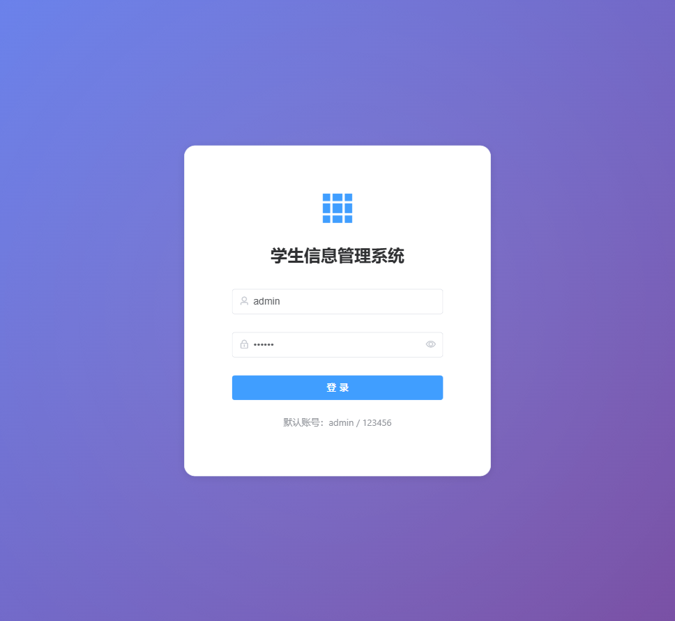
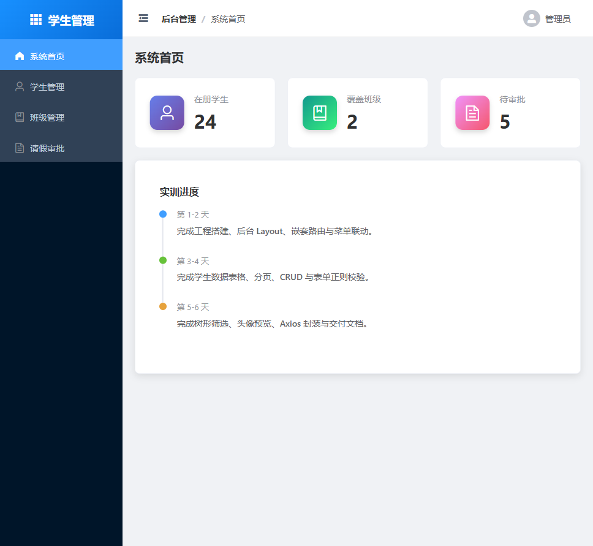
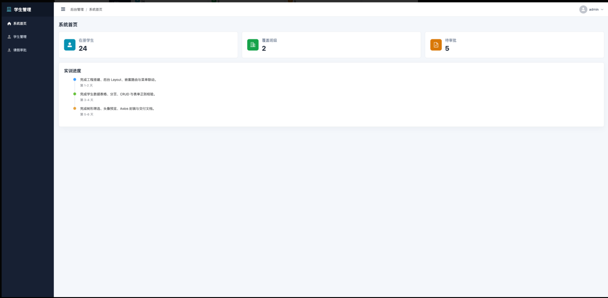
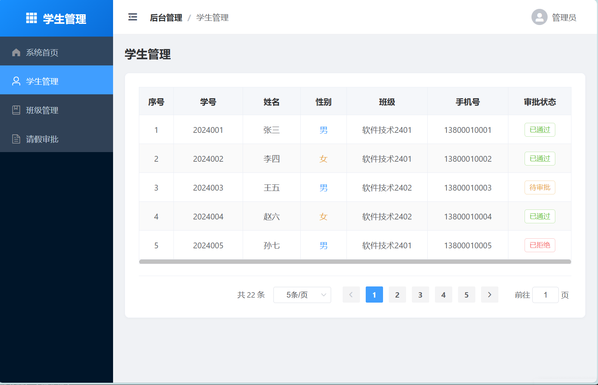

# 学生信息管理系统

> 基于 Vue 2.x + Element-UI 的通用后台管理系统

## 个人信息与交付链接

* **姓名**：杨子正
* **学号**：992431304029
* **班级**：软件技术2401
* **项目名称**：学生信息管理系统
* **项目仓库链接**：https://gitee.com/yang-zizheng1/vue-project
* **项目完成日期**：2026-06-08
* **交付说明**：已完成 Class 1（工程搭建与后台 Layout 布局）、Class 2（嵌套路由配置与动态导航联动）和 Class 3（学生数据表格渲染与前端分页），项目已推送到 Gitee 远程仓库，开发环境可正常运行。

## 核心技术栈

* **前端框架**：Vue 2.6.14
* **脚手架工具**：Vue CLI 5.0.0
* **路由管理**：Vue Router 3.5.1
* **UI 组件库**：Element-UI 2.15.14
* **HTTP 请求库**：Axios 1.6.0
* **数据持久化方式**：LocalStorage（模拟登录 token 和用户信息）
* **版本控制工具**：Git + Gitee
* **开发工具**：VS Code、Node.js 18.x、npm
* **其他技术说明**：单页面应用（SPA）、嵌套路由、路由守卫鉴权、菜单与路由联动、动态面包屑导航、响应式布局

## 项目目录结构说明

```text
vue-project/
├── public/                  # 静态资源目录
│   └── index.html           # HTML 模板文件
├── src/
│   ├── layout/              # 布局组件
│   │   └── MainLayout.vue   # 主布局（侧边栏+Header+内容区）
│   ├── router/              # 路由配置
│   │   └── index.js         # 路由表及路由守卫
│   ├── views/               # 页面视图组件
│   │   ├── Login.vue        # 登录页面
│   │   ├── Dashboard.vue    # 系统首页
│   │   ├── StudentManage.vue # 学生管理页面
│   │   ├── ClassManage.vue  # 班级管理页面
│   │   └── GradeManage.vue  # 请假审批页面
│   ├── components/          # 公共组件目录（待扩展）
│   ├── App.vue              # 根组件
│   └── main.js              # 项目入口文件
├── .gitignore               # Git 忽略配置
├── babel.config.js          # Babel 转译配置
├── package.json             # 项目依赖与脚本配置
├── vue.config.js            # Vue CLI 配置
── README.md                # 项目说明文档
```

## 本地运行与开发步骤

### 1. 克隆仓库到本地

```bash
git clone https://gitee.com/yang-zizheng1/vue-project.git
```

### 2. 进入项目目录

```bash
cd vue-project
```

### 3. 安装项目依赖

```bash
npm install
```

* **安装说明**：自动安装 Vue 2、Vue Router、Element-UI、Axios 等核心依赖

### 4. 启动开发服务器

```bash
npm run serve
```

* **访问地址**：http://localhost:8080/
* **默认登录账号**：admin
* **默认登录密码**：123456
* **运行说明**：启动后浏览器会自动打开，首次访问会自动跳转到登录页面。登录成功后进入后台管理系统。

### 5. 生产环境打包

```bash
npm run build
```

* **打包结果说明**：生成 dist 目录，包含压缩后的静态资源文件，可直接部署到 Web 服务器

## 界面入口信息

* **系统登录入口**：http://localhost:8080/login
* **默认登录账号**：`admin`
* **默认登录密码**：`123456`
* **后台首页入口**：http://localhost:8080/dashboard
* **学生管理入口**：左侧菜单"学生管理" 或 http://localhost:8080/students
* **班级管理入口**：左侧菜单"班级管理" 或 http://localhost:8080/classes
* **请假审批入口**：左侧菜单"请假审批" 或 http://localhost:8080/grades
* **退出登录入口**：顶部 Header 右侧用户头像下拉菜单 → "退出登录"
* **未登录拦截说明**：通过路由守卫实现，未登录用户访问后台页面（除 `/login` 外）会自动跳转到登录页
* **界面入口截图**：

## 系统功能模块

### 功能一：系统后台主体布局

* **功能描述**：实现经典的中后台管理界面布局，包含左侧可折叠导航菜单、顶部 Header 和右侧主内容区
* **实现思路**：使用 Element-UI 的 `el-container`、`el-aside`、`el-header`、`el-main` 组件搭建布局框架
* **涉及页面或组件**：`src/layout/MainLayout.vue`
* **关键技术点**：Flex 布局、侧边栏折叠动画、响应式设计
* **运行截图**：

### 功能二：嵌套路由与菜单联动

* **功能描述**：实现嵌套路由配置，点击左侧菜单自动切换右侧页面，刷新页面保持菜单高亮状态
* **实现思路**：使用 Vue Router 的嵌套路由功能，`el-menu` 组件启用 `router` 属性实现路由联动
* **涉及页面或组件**：`src/router/index.js`、`src/layout/MainLayout.vue`
* **关键技术点**：嵌套路由配置、`router-view` 渲染、菜单高亮状态管理
* **运行截图**：

### 功能三：登录鉴权与路由守卫

* **功能描述**：实现用户登录功能和路由守卫，未登录用户无法访问后台页面
* **实现思路**：使用 `router.beforeEach` 全局前置守卫，通过 LocalStorage 存储 token 实现登录状态管理
* **涉及页面或组件**：`src/views/Login.vue`、`src/router/index.js`
* **关键技术点**：路由守卫、Local Storage、表单验证、模拟登录
* **运行截图**：

### 功能四：系统首页数据概览

* **功能描述**：展示系统关键数据统计卡片和实训进度时间线
* **实现思路**：使用 Element-UI 的 `el-card`、`el-timeline` 组件展示统计信息和进度
* **涉及页面或组件**：`src/views/Dashboard.vue`
* **关键技术点**：卡片布局、渐变图标、时间线组件、悬停动画效果
* **运行截图**：【请在此处粘贴截图】
* **截图说明**：展示系统首页的统计卡片和进度时间线

### 功能五：面包屑导航与用户信息

* **功能描述**：顶部 Header 显示面包屑导航和用户信息下拉菜单
* **实现思路**：通过路由元信息动态生成面包屑，使用 `el-dropdown` 实现用户菜单
* **涉及页面或组件**：`src/layout/MainLayout.vue`
* **关键技术点**：路由元信息、动态面包屑、下拉菜单、用户交互
* **运行截图**：【请在此处粘贴截图】
* **截图说明**：展示面包屑导航和用户下拉菜单

### 功能六：界面样式优化

* **功能描述**：优化系统整体视觉效果，包括侧边栏、卡片、登录页面等组件的样式
* **实现思路**：使用 CSS 渐变、阴影、动画等效果提升视觉体验
* **涉及页面或组件**：所有页面组件
* **关键技术点**：CSS 动画、渐变背景、悬停效果、响应式设计
* **运行截图**：【请在此处粘贴截图】
* **截图说明**：展示优化后的界面效果

## 实训记录与截图

### class1：工程搭建与后台 Layout 布局

* **完成内容**：
  - Git 仓库初始化与 .gitignore 配置
  - 使用 Vue CLI 创建 Vue 2 项目
  - 引入 Element-UI UI 框架
  - 搭建经典中后台布局（侧边栏+Header+内容区）
  - 推送到 Gitee 远程仓库
* **核心代码或文件**：`src/layout/MainLayout.vue`、`.gitignore`、`package.json`
* **遇到的问题**：Gitee 推送认证失败（使用密码而非私人令牌）
* **解决方法**：使用私人令牌（Private Token）进行 HTTPS 推送认证
* **Git 提交记录**：`42305db feat: 初始化学生信息管理系统项目`
* **运行截图**：
* **截图说明**：展示后台布局效果

### class2：嵌套路由配置与动态导航联动

* **完成内容**：
  - 创建 Login 登录页面组件
  - 配置嵌套路由（Login + 主 Layout 子路由）
  - 实现导航菜单与路由高亮联动
  - 编写路由守卫拦截未登录用户
  - 优化界面样式（侧边栏、卡片、登录页面动画）
* **核心代码或文件**：`src/router/index.js`、`src/views/Login.vue`、`src/views/Dashboard.vue`
* **遇到的问题**：ESLint 组件命名警告（单单词组件名）
* **解决方法**：忽略 ESLint 警告（项目配置允许单单词组件名）
* **Git 提交记录**：
  - `6674c58 feat:配置后台嵌套路由表`
  - `36d4dba feat:实现菜单与路由高亮联动`
* **运行截图**：

* **截图说明**：展示登录页面和后台菜单联动效果

### class3：学生数据表格渲染与前端分页

* **完成内容**：
  - 设计包含 22 条数据的静态 Mock 学生信息数组
  - 使用 el-table 和 el-table-column 渲染学生数据列表
  - 利用作用域插槽 slot-scope 将性别字段转换为带颜色文字、将审批状态渲染为不同颜色的 el-tag
  - 引入 el-pagination 组件，使用 JS slice 方法实现纯前端动态分页
  - 支持每页条数切换（5/10/15/20）和页码跳转
* **核心代码或文件**：`src/views/StudentManage.vue`
* **遇到的问题**：el-table 的 type="index" 序号列在翻页时会自动重置从 1 开始，无法保证跨页序号连续
* **解决方法**：通过 el-table-column 的 :index 属性绑定自定义 indexMethod 方法，计算偏移量 `(currentPage - 1) * pageSize + index + 1` 实现跨页连续序号
* **Git 提交记录**：`b29dbfb feat:编写学生数据列表展示及前端分页逻辑`
* **运行截图**：
* **截图说明**：展示学生数据表格、性别与审批状态插槽渲染以及前端分页组件

### class4：核心数据 CRUD 与表单正则校验

* **完成内容**：【待完成】
* **核心代码或文件**：【待补充】
* **遇到的问题**：【待补充】
* **解决方法**：【待补充】
* **Git 提交记录**：【待补充】
* **运行截图**：【待补充】
* **截图说明**：【待补充】

### class5：高级组件拓展与父子组件通信

* **完成内容**：【待完成】
* **核心代码或文件**：【待补充】
* **遇到的问题**：【待补充】
* **解决方法**：【待补充】
* **Git 提交记录**：【待补充】
* **运行截图**：【待补充】
* **截图说明**：【待补充】

### class6：Axios 封装与前端工程交付

* **完成内容**：【待完成】
* **核心代码或文件**：【待补充】
* **遇到的问题**：【待补充】
* **解决方法**：【待补充】
* **Git 提交记录**：【待补充】
* **运行截图**：【待补充】
* **截图说明**：【待补充】

## Git 提交里程碑

1. `4ab21c4` docs: 优化 README 图片管理 —— README 文档完善与截图管理
2. `525fcde` docs: 完善项目交付 README 文档 —— 项目交付文档编写
3. `6674c58` feat:配置后台嵌套路由表 —— 优化路由守卫，修复子路由鉴权
4. `36d4dba` feat:实现菜单与路由高亮联动 —— 补全班级管理菜单项，完善退出登录功能

## 验收自查表

* ✅ 是 - 本地项目可正常启动
*  待验证 - 项目可正常打包
* ✅ 是 - 登录与路由守卫功能正常
* ✅ 是 - 后台 Layout 与菜单联动正常
* ✅ 是 - 学生列表、分页和状态显示正常
* ⏳ 待完成 - 新增、编辑、删除、查询功能正常
* ⏳ 待完成 - 表单必填、学号、手机号校验正常
* ⏳ 待完成 - 组织架构树筛选功能正常
* ⏳ 待完成 - 头像上传预览功能正常
* ️ 部分完成 - README 已补齐文字说明，运行截图待补充

## 后续开发计划

- [x] Class 3：学生数据表格渲染与前端分页
- [ ] Class 4：学生信息 CRUD 操作与表单校验
- [ ] Class 5：组织架构树与头像上传功能
- [ ] Class 6：Axios 封装与工程交付
- [ ] 完善所有功能模块的运行截图
- [ ] 补充个人信息（学号、班级）
- [ ] 项目打包测试

## License

MIT
